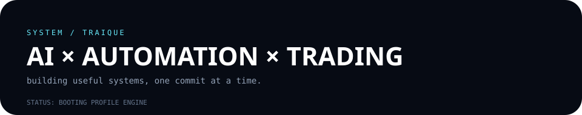
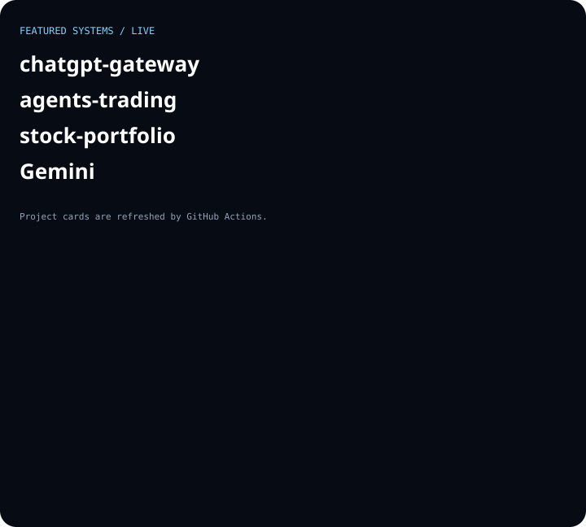

## ⚡ Tôi xây dựng gì?

**AI · Tự động hóa · Hệ thống giao dịch · Developer Tools** — tập trung vào những hệ thống thực tế, có thể triển khai và vận hành.

## 🚀 4 hệ thống nổi bật

- [**chatgpt-gateway**](https://github.com/traique/chatgpt-gateway) — Gateway ChatGPT/Codex với FastAPI, Supabase và API tương thích OpenAI.
- [**agents-trading**](https://github.com/traique/agents-trading) — hệ thống multi-agent nghiên cứu chứng khoán Việt Nam.
- [**stock-portfolio**](https://github.com/traique/stock-portfolio) — quản lý danh mục, dữ liệu thị trường và AI phân tích cổ phiếu Việt Nam.
- [**Gemini**](https://github.com/traique/Gemini) — trợ lý AI cá nhân với Telegram, memory, tools và stock research.

## 🧠 Tech stack

`Python` · `TypeScript` · `Next.js` · `FastAPI` · `Supabase` · `LLM Agents` · `GitHub Actions` · `Quant Research`

## 📡 Hồ sơ sống

Các số liệu và artwork trên trang này được **GitHub Actions tự động cập nhật mỗi 12 giờ** từ dữ liệu GitHub thực tế. Không dùng widget thống kê bên ngoài, không JavaScript phía client và không hardcode số liệu hoạt động.

`BUILD → MEASURE → AUTOMATE → REPEAT`

⚙️ Hồ sơ tự vận hành · cập nhật tự động

